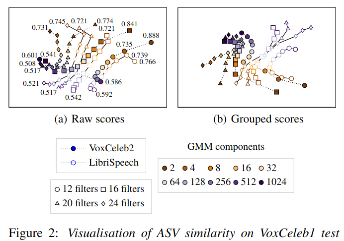

# Classifier Adjacency Visualisation
Demo script for visualising behaviour, (dis)similarity or complementarity of binary classifiers in response to a common dataset.

The recipe itself is simple:
* compute rank correlation of scores (Kendall's tau)
* visualise with multidimensional scaling (MDS plot)

## Please reference our paper
```
Kinnunen, T., Nautsch, A., Sahidullah, M., Evans, N., Wang, X., Todisco, M., Delgado, H., Yamagishi J, Lee, K.A.,
"Visualizing Classifier Adjacency Relations: A Case Study in Speaker Verification and Voice Anti-Spoofing", 
in Proc. Interspeech, 2021.
```

License: https://creativecommons.org/licenses/by/4.0/


## Installation (Linux)
After installing conda:
```
conda create -n classifier-adjacency python=3.7
conda activate classifier-adjacency
pip install sklearn matplotlib pandas h5py
git clone https://gitlab.eurecom.fr/nautsch/pybosaris pybosaris-source
ln -s pybosaris-source/pybosaris pybosaris
```

### Use
```
python classifier_adjacency_demo.py
```

This creates two tikz/pgfplot files:
```
asv.tikz
asv_legend.tikz
```

### Tweak it a bit: figure 2(a) of our paper results

